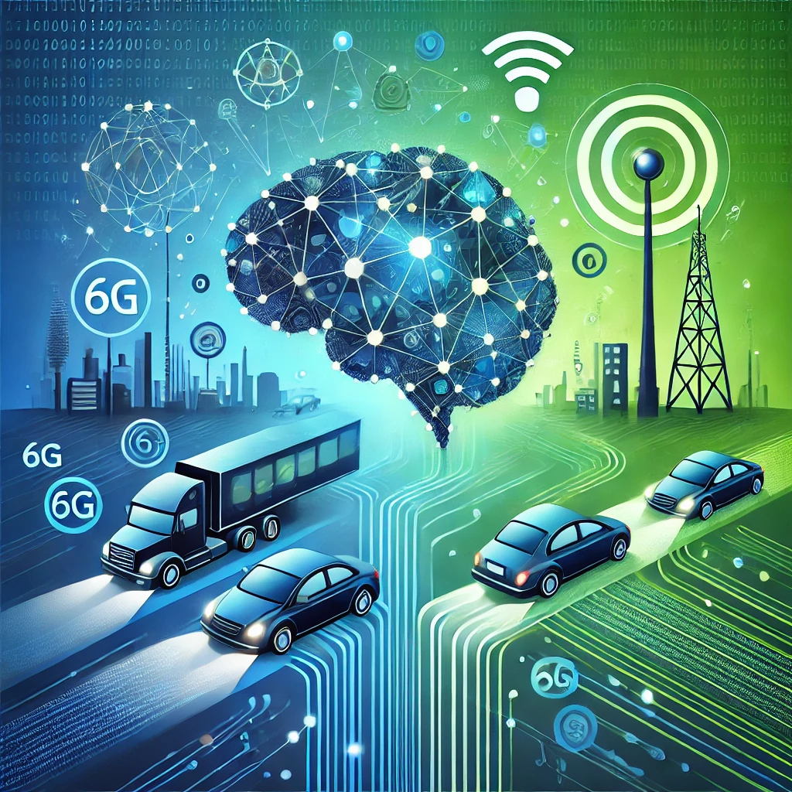

# 🚀 LLM-Powered V2X Communication Protocols 🌐

**Integrating the Power of Language Models into Next-Gen Vehicle Communication**



## 📖 Overview

Welcome to **LLM-Powered V2X Communication Protocols**—where cutting-edge AI meets next-generation vehicular communication! This project is an innovative fusion of Large Language Models (LLMs) with 6G Vehicle-to-Everything (V2X) networks, aimed at revolutionizing how vehicles communicate with each other and the world around them.

Imagine a transportation system where vehicles understand context, compress messages semantically, and break language barriers—all in real-time. This is not the future; this is now.

## 🌟 Key Features

### 🧠 Semantic Compression

- **Intelligent Compression**: Utilize LLMs to semantically compress messages, significantly reducing bandwidth usage without sacrificing critical information.
- **Efficiency Boost**: Achieve faster data transmission with lower latency, crucial for time-sensitive vehicular communications.

### 🔍 Context-Aware Messaging

- **Dynamic Context Integration**: Embed real-time contextual data (location, time, traffic conditions) directly into communications.
- **Enhanced Decision-Making**: Provide vehicles with richer information for better autonomous decision-making.

### 🌍 Multi-Language Support

- **Global Communication**: Seamlessly translate messages between multiple languages, facilitating international interoperability.
- **Cultural Sensitivity**: Adapt communications to local languages and norms, improving user experience.

## 🎯 Why LLM-Powered V2X?

As autonomous vehicles become more prevalent, the need for smarter, faster, and more reliable communication protocols is paramount. By integrating LLMs into V2X communications, we unlock new possibilities:

- **Safety**: Improved communication reduces the likelihood of accidents.
- **Efficiency**: Optimized traffic flow and reduced congestion.
- **Scalability**: Ready for global deployment with multi-language support.

## 🛠️ Installation Guide

Get up and running in minutes!

```bash
# Clone the repository
git clone https://github.com/username/LLM-Powered-V2X-Protocols.git

# Navigate to the project directory
cd LLM-Powered-V2X-Protocols

# Install dependencies
pip install -r requirements.txt
```

## 🚀 Quick Start

Experience the power of LLM-Powered V2X Communication:

```bash
# Run the main application
python src/main.py
```

## 🔧 Configuration

Customize the system to your needs by modifying the configuration files in the `src/config/` directory.

## 📚 Documentation & Resources

- **[User Guide](docs/usage.md)**: Comprehensive instructions to maximize your experience.
- **[Developer Docs](docs/api_reference.md)**: Dive deep into the codebase and APIs.
- **[System Architecture](docs/architecture.md)**: Understand the design principles and architecture.
- **[FAQs](docs/faq.md)**: Find answers to common questions.

## 💡 Live Demos & Examples

See the system in action:

- **[Interactive Jupyter Notebook](examples/demo.ipynb)**: Explore our features hands-on.
- **[Video Demonstration](https://youtu.be/your_video_link)**: Watch a walkthrough of the key functionalities.

## ⭐️ Support the Project

If you find this project valuable, please give me a star on GitHub! ⭐️

---

*Let's drive into the future together, where every vehicle is smarter, every journey is safer, and every destination is within reach.*

---
